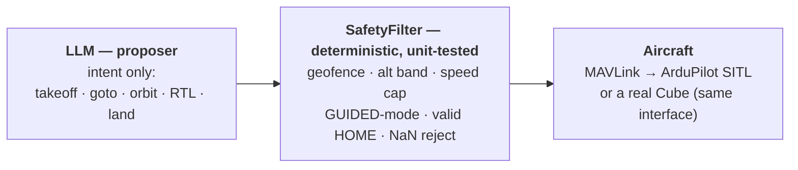

# Engineering Portfolio — William Chadwick Love

**Self-directed engineer** — autonomy & robotics, applied ML, offensive/defensive security,
and the embedded and RF hardware underneath. I ship real systems by **directing AI**, and I
hold the results to engineering standards: reverse-engineer the objective, build the harness
that proves it, and guard the fallible model with deterministic code.

📫 william.chadwick.love2@gmail.com · [kaggle.com/wraith53](https://www.kaggle.com/wraith53)

> This repository answers a specific ask: **code samples, a system design I'm proud of, and
> evaluation/benchmark work that shows technical rigor** — and, honestly, **how I used AI to
> build it.**

---

## How I use AI (answering the P.S. first)

I treat a model as a **fast, fallible executor** and put the engineering around it. My loop is
the same every time:

1. **Define the real objective** — often by reverse-engineering it.
2. **Build a validation harness** so iteration is cheap and honest.
3. **Separate a proposer (the model) from a deterministic executor & verifier** (code I can test).
4. **Unit-test the parts that must not fail.**

The model moves fast; I own what is true. That loop is why, in my **first-ever Kaggle
competition** — a $50,000 red-teaming challenge — I placed **2nd out of 4,186** under a
self-imposed rule that I would not hand-write the solution code. It recurs across this repo: an
LLM proposes flight commands and a deterministic filter disposes; a pentest agent pairs a
retrieval-grounded proposer with a 32B→72B verifier loop and 46 unit tests; a fleet
orchestrator lets a model plan while resilient SSH executes and every fix is logged to a
knowledge base.

---

## A system design I'm proud of — ERNA

**An LLM commands a real drone through a gate it cannot bypass.** The design question is where
you put the safety guarantee, and my answer is: *not in the prompt.*

The model emits **intent only**. Every command crosses one **pure function with no MAVLink
dependency**, so the whole safety envelope is covered by a unit-test suite instead of trusted to
model behavior. Live flight needs two independent keys (an env flag **and** an explicit
`--i-understand`); SITL is the default; a `--dry-run` prints the exact bytes. It puts the
AI-safety guarantee where it can be **audited and tested** — and the proposer/deterministic-guard
split generalizes to the security and infrastructure work.

→ **The whole trust boundary:** [`03_erna-ai-drone-commander/erna_cmd.py`](03_erna-ai-drone-commander/erna_cmd.py) (`check_command`) · tests in [`test_safety.py`](03_erna-ai-drone-commander/test_safety.py)

---

## Code samples

Real excerpts that show how I think about a problem:

| What | Where | Why it's interesting |
|---|---|---|
| The trust boundary between an LLM and an aircraft | [`erna_cmd.py`](03_erna-ai-drone-commander/erna_cmd.py) | Pure, dependency-free logic — so it's unit-tested, not trusted to a prompt |
| A clicked pixel → a coordinate on the earth | [`geo.py`](04_sar-pixel-lock/geo.py) | Camera ray through live drone attitude, intersected with the ground plane → lat/lon → MGRS |
| Implementing an RC protocol from the spec | [`stream_crsf.py`](07_quadplane-vtol-digital-twin/stream_crsf.py) | Bit-level CRSF (CRC + tick scaling) to clone a telemetry link |
| A from-scratch geodesy engine | [`geo.py`](04_sar-pixel-lock/geo.py) · [`erna_cmd.py`](03_erna-ai-drone-commander/erna_cmd.py) | WGS84 → MGRS, haversine, great-circle — no mapping library |

---

## Evaluation & benchmark work (technical rigor)

Rigor, to me, is refusing to trust a result I can't reproduce.

- **Kaggle red-teaming — 2nd of 4,186.** Reverse-engineered the grader out of the competition
  SDK; built an **offline validation harness** so iteration was free (the single biggest lever);
  the team turned submission runtime into a **timing oracle** that predicted whether an attack
  would survive a hidden guardrail, correct on **8 of 8** probe families.
  → [`01_ai-agent-security/`](01_ai-agent-security/)
- **Counter-UAS detection — owned end to end, measured on real silicon.** 6 datasets merged
  (117,471 images), YOLO11s → **mAP@50 0.802**, INT8-quantized and deployed on a Hailo chip at
  **20.9 FPS on-device**. → [`05_counter-uas-detection/`](05_counter-uas-detection/)
- **Autonomous pentest agent — a repeatable 8/8 benchmark** (recon → root + loot) against a
  standard vulnerable target, with 46 unit tests on the decision logic. *(Code kept private —
  see note below; available to a security-team interviewer on request.)*

---

## Projects in this repo

| | Project | Domain |
|---|---|---|
| 01 | [AI-Agent Security (Kaggle)](01_ai-agent-security/) | LLM red-teaming · 2nd / 4,186 |
| 03 | [ERNA AI Drone Commander](03_erna-ai-drone-commander/) | Autonomy · LLM + safety filter |
| 04 | [SAR Pixel-Lock](04_sar-pixel-lock/) | Applied CV · geolocation · ATAK |
| 05 | [Counter-UAS Detection](05_counter-uas-detection/) | ML lifecycle · data → edge |
| 07 | [QuadPlane VTOL Digital Twin](07_quadplane-vtol-digital-twin/) | Flight-test data · SITL · RF |
| 08 | [Orin + Cube Carrier PCB](08_orin-cube-carrier-pcb/) | 6-layer hardware · KiCad |
| 09 | [Drone CAD & Mechanical](09_drone-cad-mechanical/) | Parametric design-as-code |
| — | [CoT–MAVLink Bridge](cot-mavlink-bridge/) | Interop · joint work with U.S. Army Research Lab |

---

## A note on scope

Some of my work is **deliberately not public**: offensive-security tooling, RF/SDR transmit
research, and a GPS-denied guidance system. That's a judgment call, not a gap — public
autonomous-exploitation, jamming, or targeting code is a liability regardless of intent. Those
are documented and available to interviewers on request, in the right context.

*Built with the help of AI, directed and verified by me — which is the point.*
